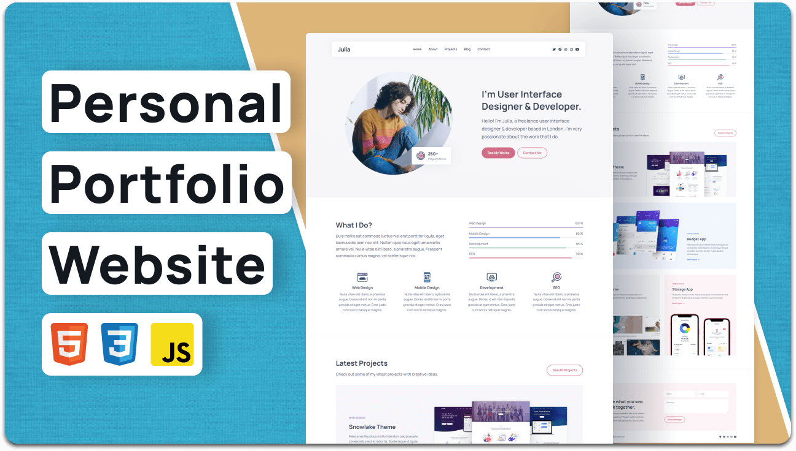

<div align="center">
  
  
  
  
  [](https://twitter.com/intent/follow?screen_name=salwawidfautami)

  <br />
  <br />

  <h2 align="center">Salwa Widfa Utami - Portfolio Website</h2>

  A fully responsive personal portfolio website. <br />Responsive for all devices, built using HTML, CSS, and JavaScript.

  <a href="https://salwawidfautami.netlify.app/"><strong>➥ Live Demo</strong></a>

</div>

<br />

### Demo Screenshot



### Prerequisites

Before you begin, make sure you have the following installed:

* [Git](https://git-scm.com/downloads) on your operating system.

### Run Locally

To run the project locally:

Linux and macOS:

```bash
sudo git clone https://github.com/salwawidfau95/salwawidfau-portfolio.git
